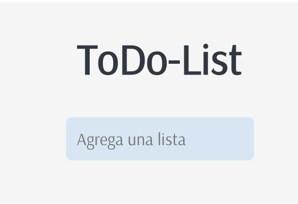

# Todo List

This is a simple Todo List application built with React.

You can try the application by following this link: [Demo](https://crisher73.github.io/todo-list/)

## Features

- Add, edit, and delete tasks.
- Mark tasks as completed.
- Filter tasks by status (all, active, completed).
- Persist data using local storage.

## Technologies Used

- React
- HTML
- CSS
- JavaScript
- Font Awesome (fortawesome/fontawesome-svg-core, fortawesome/free-solid-svg-icons, fortawesome/react-fontawesome)
- gh-pages (devDependency for deployment)

## Installation

1. Clone the repository: `git clone REPOSITORY_URL`
2. Open the project in your code editor.
3. Install dependencies by running: `npm install`

## Usage

1. Run the development server: `npm start`
2. Open the application in your browser at: [http://localhost:3000](http://localhost:3000)
3. Use the interface to manage your tasks.

## Contributing

If you would like to contribute to this project, please follow these steps:

1. Fork the repository.
2. Create a new branch: `git checkout -b new-branch`
3. Make the changes and commit them: `git commit -m 'Description of the changes'`
4. Push the branch to your forked repository: `git push origin new-branch`
5. Create a pull request in the original repository.

## Author

Cristina Hernández

## License

This project is licensed under the [MIT License](https://opensource.org/licenses/MIT). 

## Acknowledgments

I would like to thank [Alorse](https://github.com/Alorse) for challenging me to program and develop new skills.

